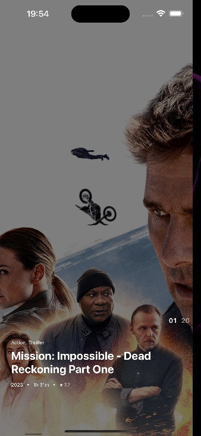

# (WIP) Movie Showcase App

Inspired by the work of [Goran Vujakovic](https://dribbble.com/goranvujakovic).

    

## About the project

(The project is still in progress)  

Developed using React Native Expo, Reanimated, and Moti, with Legend State employed for global state management. The project's objective was to gain insights into animations and gestures.

    

 
(Crafted under the guidance of [Catalin Miron](https://twitter.com/mironcatalin))

## Goals/ TODO

- [x] Add design to the filters
- [ ] Finish the animation of the filters
- [ ] Make the transitions smoother
- [ ] Use Pan gesture instead of Fling
- [ ] Add more filter options (?)
